# Search Algorithm Benchmarking

## Overview

This document describes the benchmarking process used to compare the implemented pathfinding algorithms.

The goal of the benchmark is not only to measure runtime, but also to compare:

- Search efficiency
- Memory usage
- Solution quality
- Behaviour under different grid conditions

The following algorithms are currently implemented:

- Breadth-First Search (BFS)
- Depth-First Search (DFS)
- Dijkstra's Algorithm
- A\* Search

---

## Benchmark Environment

The benchmarks were executed using:

- Python 3.14
- Generated grid-based environments
- Multiple grid sizes
- Multiple obstacle densities
- Five runs per configuration

Each algorithm receives the same:

- Grid layout
- Starting node
- Goal node

This ensures that algorithm comparisons are performed under identical conditions.

---

## Test Configurations

### Grid Sizes

The following grid dimensions were tested:

| Size        |     Nodes |
| ----------- | --------: |
| 100 x 100   |    10,000 |
| 250 x 250   |    62,500 |
| 500 x 500   |   250,000 |
| 1000 x 1000 | 1,000,000 |

---

### Obstacle Density

Three grid scenarios were benchmarked:

| Scenario | Obstacle Probability | Description             |
| -------- | -------------------: | ----------------------- |
| Open     |                  0.0 | No obstacles            |
| Sparse   |                  0.1 | Lightly obstructed grid |
| Dense    |                  0.3 | Highly obstructed grid  |

Random grid generation uses a fixed seed per run to ensure results are reproducible.

---

## Metrics

The following metrics are collected for each algorithm execution.

### Runtime

Measured using Python's `time.perf_counter()`.

This represents the total execution time required to find a path or determine that no path exists.

---

### Memory Usage

Measured using Python's `tracemalloc`.

The benchmark records peak memory allocation during execution.

---

### Nodes Expanded

The number of nodes removed from the search frontier and processed.

This provides a measure of how much of the search space an algorithm explores.

---

### Nodes Discovered

The total number of unique nodes added to the search process.

This provides insight into the size of the explored search space.

---

### Path Length

The number of steps in the returned path.

This measures solution quality.

Algorithms such as BFS, Dijkstra, and A\* should return optimal paths on unweighted grids, while DFS may return longer paths depending on traversal order.

---

### Success Rate

The percentage of runs where a valid path was found.

This is particularly relevant for dense grids, where random obstacle placement can create unsolvable environments.

---

# Results

## Runtime

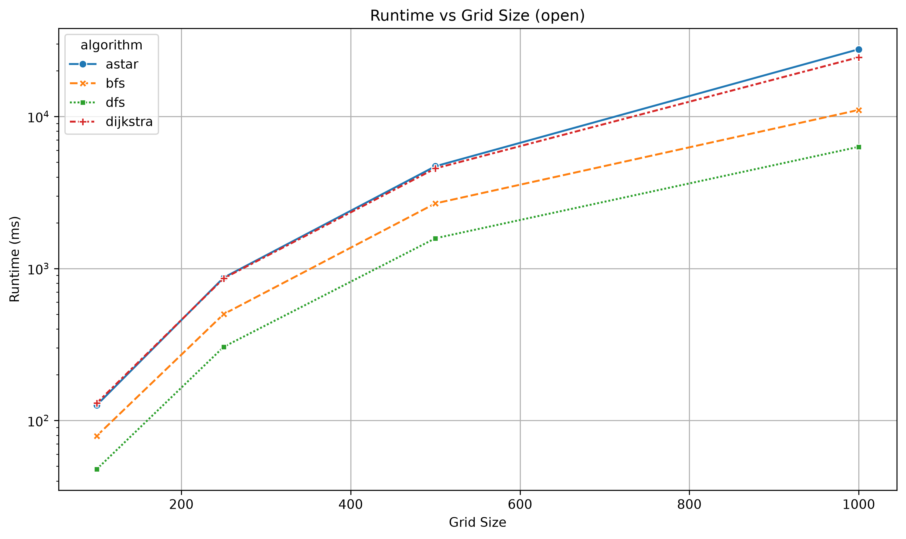

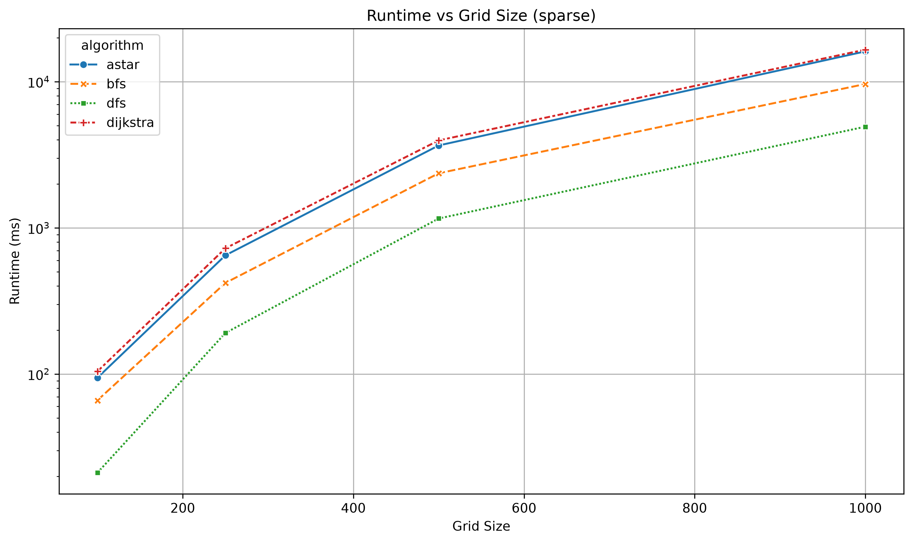

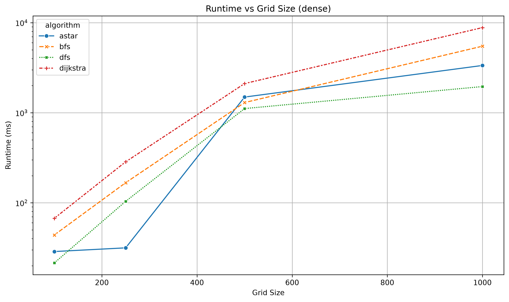

Runtime measures practical performance, but should be considered alongside the number of explored nodes and memory usage.

---

## Nodes Expanded

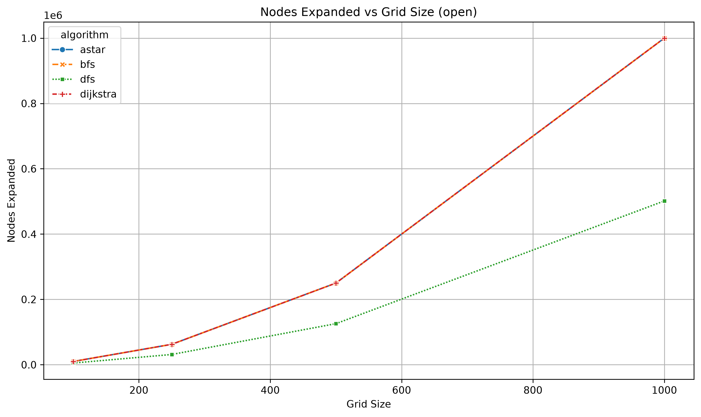

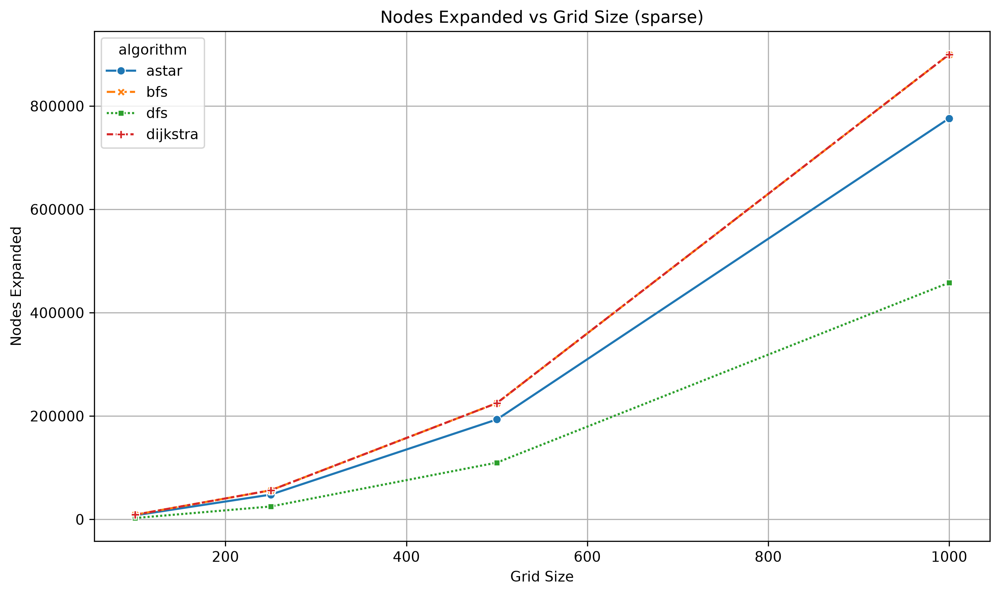

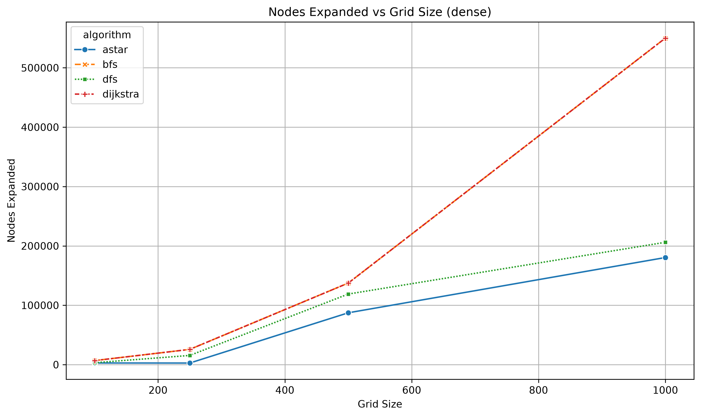

Nodes expanded provides a clearer view of the underlying search efficiency.

---

## Memory Usage

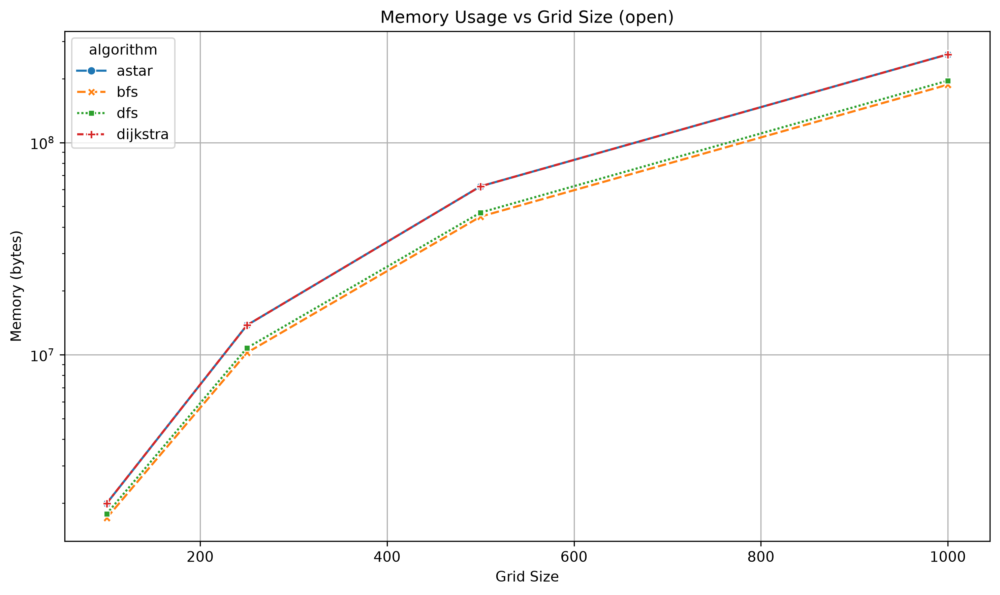

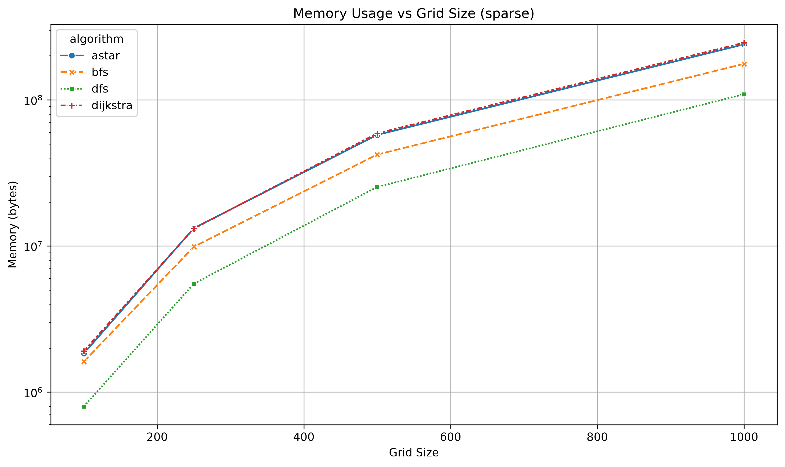

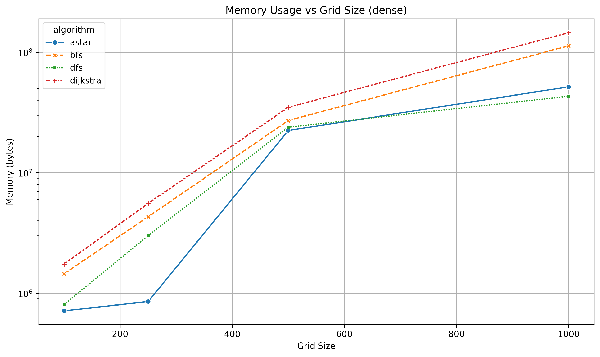

---

## Path Length

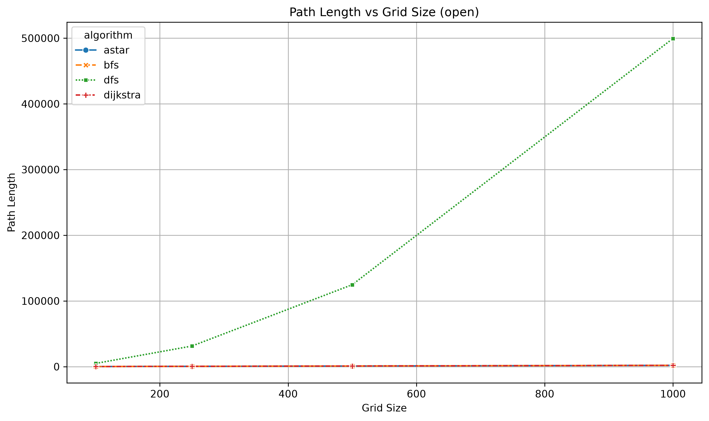

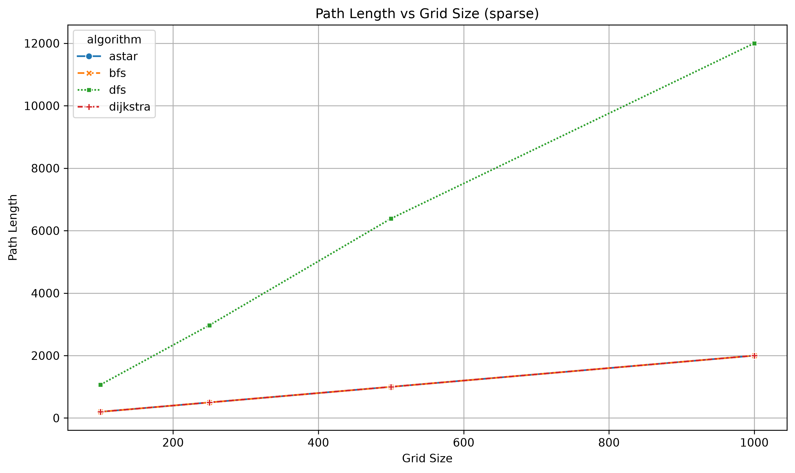

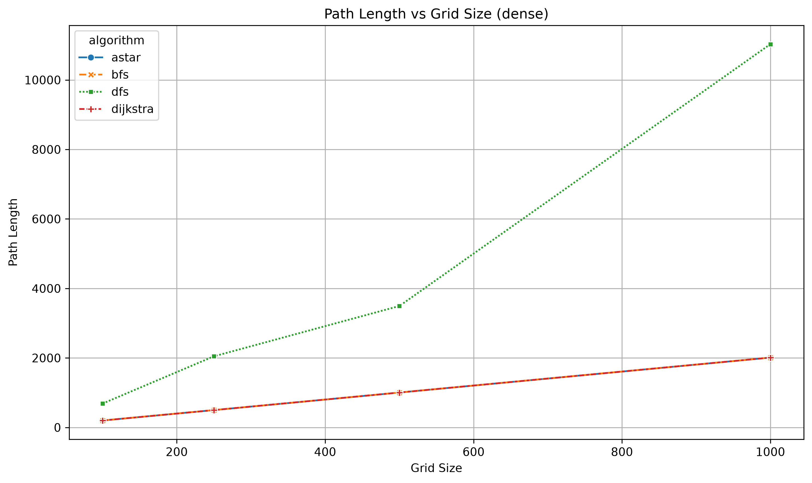

---

# Observations

## BFS vs Dijkstra

On the current grid implementation, every movement has equal cost.

Because of this:

- BFS explores nodes in increasing distance from the start.
- Dijkstra explores nodes in increasing accumulated cost.

When all edge costs are equal:

```python
[
cost(edge)=1
]
```

Dijkstra provides no advantage over BFS.

This is reflected in the benchmark results, where BFS and Dijkstra often expand the same number of nodes.

---

## DFS Tradeoff

DFS often explores fewer nodes and can find a path quickly.

However, it does not guarantee the shortest path.

This creates a tradeoff:

| Algorithm | Shortest Path | Fast Discovery    |
| --------- | ------------- | ----------------- |
| BFS       | Yes           | Moderate          |
| DFS       | No            | Often fast        |
| Dijkstra  | Yes           | Slower            |
| A\*       | Yes           | Usually efficient |

---

## A\* Search

A\* combines:

- The cost already travelled (`g`)
- A heuristic estimate of remaining distance (`h`)

using:

```python
[
f(n)=g(n)+h(n)
]
```

The benchmark shows that A\* generally expands fewer nodes than uninformed searches, especially in more constrained environments.

However, on completely open grids, the additional priority queue operations and heuristic calculations can reduce the runtime advantage.

---

# Limitations

The current benchmark has several limitations:

- Grid generation does not guarantee a valid path exists.
- Only uniform movement costs are currently supported.
- Python implementation overhead affects absolute runtime measurements.
- Five runs per configuration provides an initial comparison but more runs would reduce variance.

Future improvements may include:

- Weighted terrain costs
- Guaranteed-solvable maze generation
- Larger benchmark sample sizes
- Additional algorithms such as Greedy Best-First Search
- Comparison between different graph representations
